# Saathy Architecture Graphs

This document provides comprehensive visual representations of the Saathy AI copilot architecture, from high-level system overview to detailed component relationships.

## 1. High-Level System Architecture

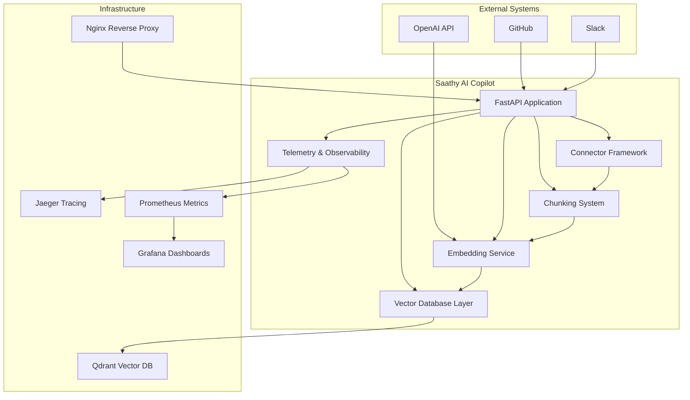

## 2. Application Layer Architecture

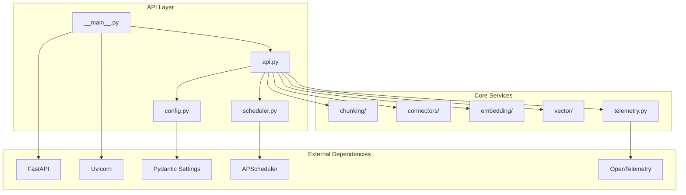

## 3. Connector Framework Architecture

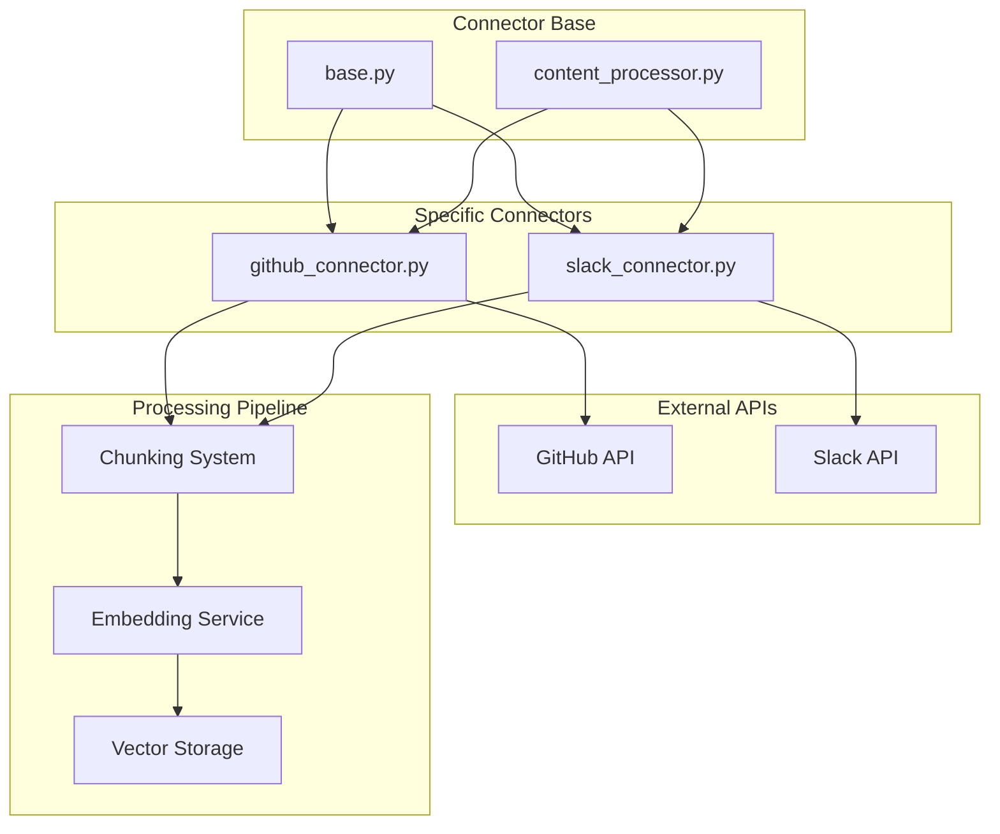

## 4. Chunking System Architecture

```mermaid
graph TB
    subgraph "Chunking Processor"
        PROC[processor.py]
        STRAT[strategies.py]
    end
    
    subgraph "Strategy Implementations"
        FIXED[fixed_size.py]
        SEM[semantic.py]
        DOC[document.py]
        CODE[code.py]
        EMAIL[email.py]
        MEET[meeting.py]
        SLACK[slack_message.py]
        GIT[git_commit.py]
    end
    
    subgraph "Core Components"
        INTERF[interfaces.py]
        MODELS[models.py]
        EXCEPT[exceptions.py]
    end
    
    subgraph "Utilities"
        CACHE[chunk_cache.py]
        MERGE[chunk_merger.py]
        DETECT[content_detector.py]
        HASH[hash_utils.py]
        QUAL[quality_validator.py]
    end
    
    subgraph "Analysis"
        ANALYZE[analyzer.py]
        VIZ[visualizer.py]
    end
    
    PROC --> STRAT
    STRAT --> FIXED
    STRAT --> SEM
    STRAT --> DOC
    STRAT --> CODE
    STRAT --> EMAIL
    STRAT --> MEET
    STRAT --> SLACK
    STRAT --> GIT
    
    PROC --> INTERF
    PROC --> MODELS
    PROC --> EXCEPT
    
    PROC --> CACHE
    PROC --> MERGE
    PROC --> DETECT
    PROC --> HASH
    PROC --> QUAL
    
    PROC --> ANALYZE
    ANALYZE --> VIZ
```

## 5. Vector Database Layer Architecture

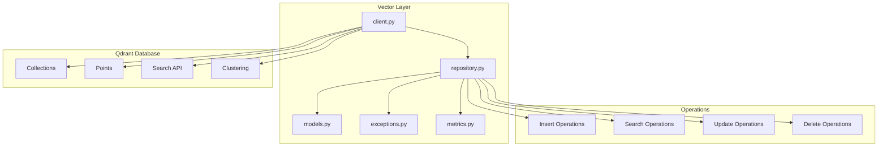

## 6. Embedding Service Architecture

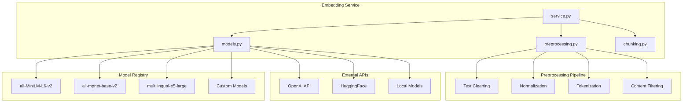

## 7. Data Flow Architecture

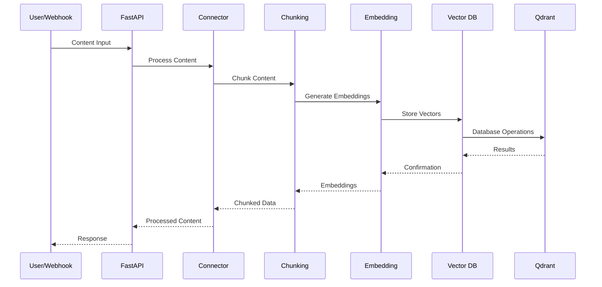

## 8. Configuration Architecture

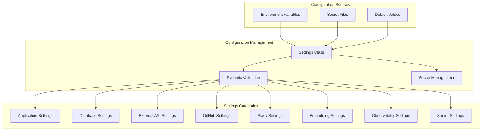

## 9. Deployment Architecture

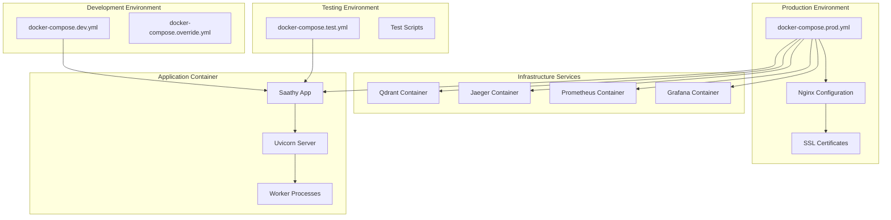

## 10. Monitoring and Observability Architecture

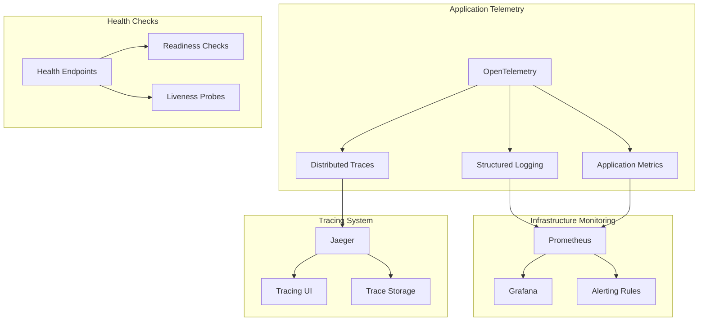

## 11. API Endpoints Architecture

```mermaid
graph TB
    subgraph "Health & Configuration"
        HEALTH[/healthz]
        READY[/readyz]
        CONFIG[/config]
    end
    
    subgraph "GitHub Connector"
        GH_WEBHOOK[/webhooks/github]
        GH_STATUS[/connectors/github/status]
        GH_SYNC[/connectors/github/sync]
    end
    
    subgraph "Slack Connector"
        SL_STATUS[/connectors/slack/status]
        SL_START[/connectors/slack/start]
        SL_STOP[/connectors/slack/stop]
        SL_CHANNELS[/connectors/slack/channels]
        SL_PROCESS[/connectors/slack/process]
    end
    
    subgraph "Content Processing"
        PROCESS[/process]
        CHUNK[/chunk]
        EMBED[/embed]
        SEARCH[/search]
    end
    
    subgraph "Vector Operations"
        VEC_INSERT[/vectors/insert]
        VEC_SEARCH[/vectors/search]
        VEC_UPDATE[/vectors/update]
        VEC_DELETE[/vectors/delete]
    end
    
    HEALTH --> READY
    READY --> CONFIG
    
    GH_WEBHOOK --> GH_STATUS
    GH_STATUS --> GH_SYNC
    
    SL_STATUS --> SL_START
    SL_START --> SL_STOP
    SL_STOP --> SL_CHANNELS
    SL_CHANNELS --> SL_PROCESS
    
    PROCESS --> CHUNK
    CHUNK --> EMBED
    EMBED --> SEARCH
    
    VEC_INSERT --> VEC_SEARCH
    VEC_SEARCH --> VEC_UPDATE
    VEC_UPDATE --> VEC_DELETE
```

## 12. Component Dependencies Graph

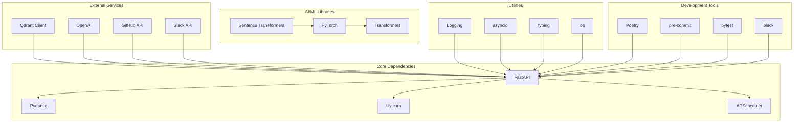

## Usage

These graphs provide different perspectives on the Saathy architecture:

1. **High-Level System Architecture**: Shows the overall system components and their relationships
2. **Application Layer Architecture**: Details the internal application structure
3. **Connector Framework Architecture**: Focuses on the extensible connector system
4. **Chunking System Architecture**: Shows the modular chunking strategies
5. **Vector Database Layer Architecture**: Details the vector storage implementation
6. **Embedding Service Architecture**: Shows the embedding model management
7. **Data Flow Architecture**: Illustrates the sequence of operations
8. **Configuration Architecture**: Shows how configuration is managed
9. **Deployment Architecture**: Details the containerized deployment
10. **Monitoring and Observability Architecture**: Shows the observability stack
11. **API Endpoints Architecture**: Maps all available API endpoints
12. **Component Dependencies Graph**: Shows library and service dependencies

Each graph can be rendered using Mermaid-compatible tools or viewed directly in GitHub/GitLab markdown files.